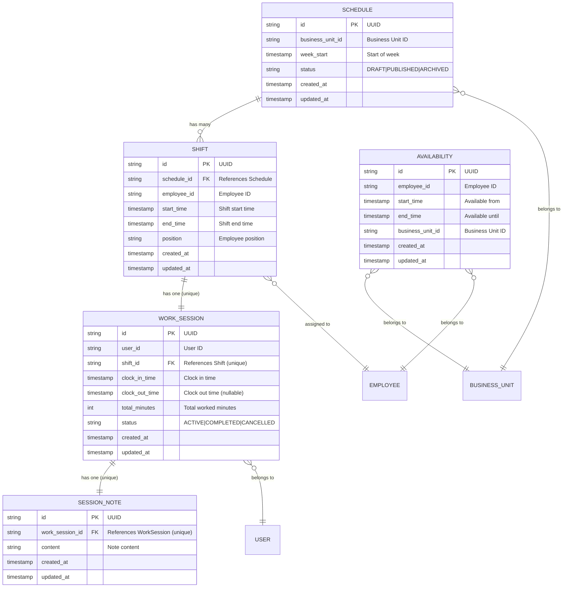

# Planning Service - Entity Relationship Diagram

## Entities and Relationships



## Entity Descriptions

### Core Planning Entities

#### **Schedule**
- **Purpose**: Represents a weekly schedule for a business unit
- **Key Properties**:
  - `business_unit_id`: Links to a specific business unit (restaurant, store, etc.)
  - `week_start`: The start date of the week this schedule covers
  - `status`: Current state of the schedule (DRAFT, PUBLISHED, ARCHIVED)

#### **Shift**
- **Purpose**: Individual work shifts within a schedule
- **Key Properties**:
  - `schedule_id`: Foreign key to the parent schedule
  - `employee_id`: ID of the assigned employee
  - `start_time`/`end_time`: When the shift starts and ends
  - `position`: The role/position for this shift

#### **Availability**
- **Purpose**: Employee availability periods
- **Key Properties**:
  - `employee_id`: ID of the employee
  - `business_unit_id`: Business unit this availability applies to
  - `start_time`/`end_time`: Available time period

### Workload Tracking Entities

#### **WorkSession**
- **Purpose**: Tracks actual work performed (clock in/out) for shifts
- **Key Properties**:
  - `shift_id`: One-to-one relationship with a shift (unique constraint)
  - `user_id`: The user who performed the work
  - `clock_in_time`: When work started
  - `clock_out_time`: When work ended (nullable for active sessions)
  - `total_minutes`: Calculated total work time
  - `status`: Current state (ACTIVE, COMPLETED, CANCELLED)

#### **SessionNote**
- **Purpose**: Notes and comments attached to work sessions
- **Key Properties**:
  - `work_session_id`: Foreign key to the parent work session (unique constraint enforces one-to-one)
  - `content`: The note content

## Relationship Details

### Direct Database Relationships (Foreign Keys)
1. **Schedule → Shift**: One schedule can have many shifts
   - `shifts.schedule_id` → `schedules.id`
   - Cascade delete: When a schedule is deleted, all its shifts are deleted

2. **Shift → WorkSession**: One shift has exactly one work session
   - `work_sessions.shift_id` → `shifts.id` (unique constraint)
   - Cascade delete: When a shift is deleted, its work session is deleted

3. **WorkSession → SessionNote**: One work session has exactly one note
   - `session_notes.work_session_id` → `work_sessions.id` (unique constraint)

### Logical Relationships (No Foreign Keys)
1. **Business Unit Relationships**:
   - Schedules and Availabilities are linked through `business_unit_id`
   - This allows querying availability for employees in the same business unit as a schedule

2. **Employee Relationships**:
   - Shifts and Availabilities are linked through `employee_id`
   - This enables checking if an employee is available for a scheduled shift

3. **User Relationships**:
   - WorkSessions are linked to users through `user_id`
   - This tracks who actually performed the work (may differ from the scheduled employee)

## Data Flow Example

```
Business Unit
    ↓
Schedule (Draft) 
    ↓
Multiple Shifts (based on Employee Availabilities)
    ↓
WorkSessions (when employees clock in/out)
    ↓
SessionNote (single optional note per work session)
``` 